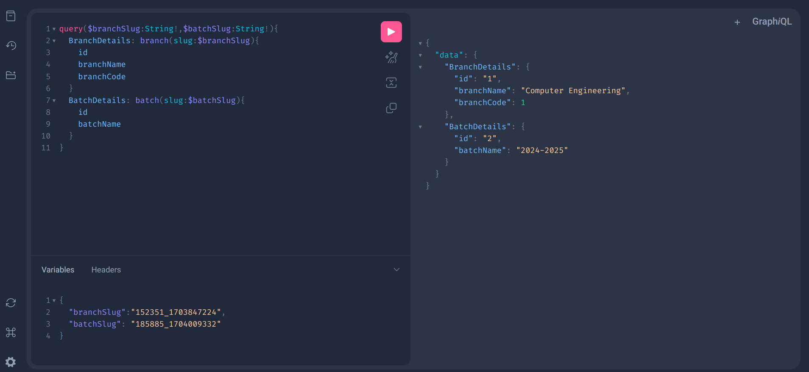
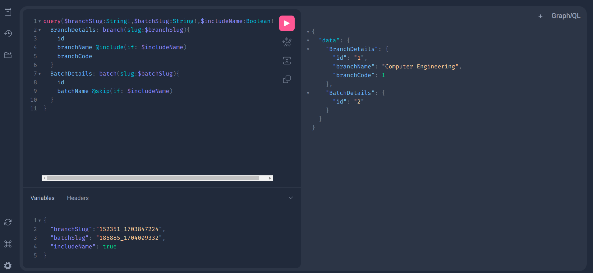

# Queries and Mutations

## Fields[#](https://graphql.org/learn/queries/#fields)

```json
query{
  allBranches {
    id
    branchName
    branchCode
  }
}

OUTPUT:
{
  "data": {
    "allBranches": [
      {
        "id": "1",
        "branchName": "Computer Engineering",
        "branchCode": 1
      }
    ]
  }
}
```

## Arguments[#](https://graphql.org/learn/queries/#fields)

```json
query{
  branch(id:1) {
    id
    branchName
    branchCode
  }
}

OUTPUT:
{
  "data": {
    "branch": {
      "id": "1",
      "branchName": "Computer Engineering",
      "branchCode": 1
    }
  }
}


```

## Aliases

```json
query{
  branchDetails: allBranches{
    id
    slug
  }
  batchDetails: allBatches{
    id
    slug
  }
}

OUTPUT:

{
  "data": {
    "branchDetails": [
      {
        "id": "1",
        "slug": "152351_1703847224"
      }
    ],
    "batchDetails": [
      {
        "id": "1",
        "slug": "485403_1703964413"
      },
      {
        "id": "2",
        "slug": "185885_1704009332"
      }
    ]
  }
}
```

## Fragments[#](https://graphql.org/learn/queries/#fragments)

```json
fragment branchFragment on BranchType{
	id
  branchName
  branchCode
}

fragment batchFragment on BatchType{
  id
  batchName
  slug
}

query{
  branchDetails :allBranches{
    ...branchFragment
    batchDetails: batches{
      ...batchFragment
    }
  }
  
}

OUTPUT:
{
  "data": {
    "branchDetails": [
      {
        "id": "1",
        "branchName": "Computer Engineering",
        "branchCode": 1,
        "batchDetails": [
          {
            "id": "1",
            "batchName": "2023-2024",
            "slug": "485403_1703964413"
          },
          {
            "id": "2",
            "batchName": "2024-2025",
            "slug": "185885_1704009332"
          }
        ]
      }
    ]
  }
}
```

## Variables




## Directives[#](https://graphql.org/learn/queries/#directives)


