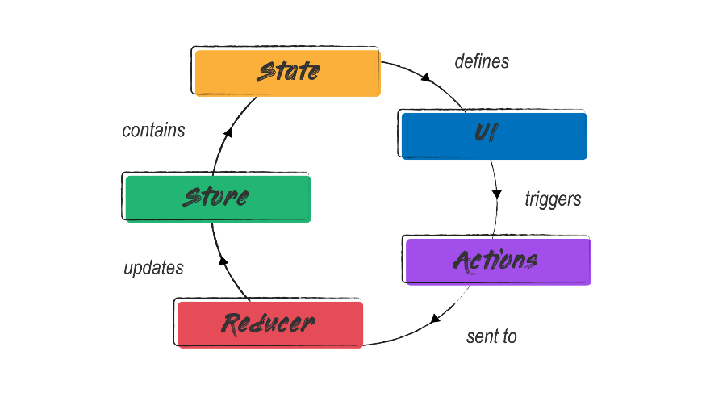

**Redux is a state management library commonly used with React.js applications. It provides a predictable state container and a set of guidelines for managing the state of your application in a consistent and scalable way.**


## What is subcription in redux? and how does it work (Like a signal)

In Redux, a subscription refers to the mechanism by which components or parts of the application can listen for changes in the Redux store's state. When the state in the store changes, the subscribed components are notified, allowing them to update their views based on the new state.


# Redux architecture




## How it works

=> Create a redux store first

For ex - 

```javascript
import { configureStore } from "@reduxjs/toolkit";
import counterReducer from './counterSlice'

export default configureStore({
    reducer: {
        counter:{}
    },
})
```


=> import the provider in App.jsx and wrap the components in it

```javascript
import { BrowserRouter as Router } from "react-router-dom";
import MainRouter from "./routes/routes";
import { useState } from "react";
import "./App.css";
import { AuthProvider } from "./context/AuthContext";
import 'bootstrap/dist/css/bootstrap.min.css';
import "react-chat-elements/dist/main.css"
import store from '../src/redux/store' 
import { Provider } from "react-redux";
import Home from "./components/main/Home";

function App() {
  const [progress, setProgress] = useState(false);
  if (typeof window !== "undefined") {
    window.setProgress = setProgress;
  }
console.log(store);
  return (
  <Provider store={store}>        
          <MainRouter />
          <Home/>  
  </Provider>
  );
}

export default App;

```

## => Now create a slice to give in the reducer

Here's a simple counter slicer

```javascript
import { createSlice } from "@reduxjs/toolkit";

const counterSlice = createSlice({
    name: 'counter',
    initialState: 0,
    reducers: {
      increment: (state) => state + 1,
      decrement: (state) => state - 1,
    },
});

export const {increment,decrement} = counterSlice.actions
export default counterSlice.reducer
```

## => Now add this slicer in the store

```javascript

import { configureStore } from "@reduxjs/toolkit";
import counterReducer from './counterSlice'

export default configureStore({
    reducer: {
        counter:counterReducer
    },
})
```

## =>  Now to access this global state we can use the useSelector and to update the state we can use the useDispatch hooks

```javascript
const count = useSelector((state) => state.counter);
const dispatch = useDispatch();
```


=> We can use the increment and decrement function to dispatch the event and update the state

```javascript
const count = useSelector((state) => state.counter);  
const dispatch = useDispatch();
```
